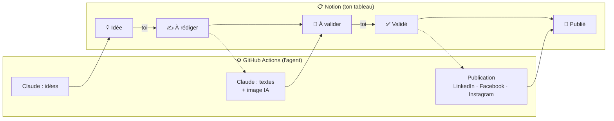

# Agent réseaux sociaux pour Claude Code

**Un agent IA qui s'occupe de tes réseaux sociaux : il propose des idées, rédige les posts,
crée les images et les publie sur LinkedIn, Facebook et Instagram. Toi, tu valides dans Notion.**

Un plugin [Claude Code](https://claude.com/claude-code) qui installe tout **pas à pas, en
conversation**, sans être développeur et sans frais en plus de ton abonnement Claude.

Pensé pour les **indépendants, artisans, commerçants et TPE** qui savent qu'il faudrait
publier régulièrement, mais n'ont ni le temps ni l'envie de s'y mettre chaque semaine.

[](LICENSE)


---

## Sommaire

- [Ce que ça donne](#ce-que-ça-donne)
- [Ce que fait l'agent](#ce-que-fait-lagent)
- [Comment ça marche](#comment-ça-marche)
- [Ce qu'il te faut](#ce-quil-te-faut)
- [Installation](#installation)
- [Les étapes de l'installation guidée](#les-étapes-de-linstallation-guidée)
- [Au quotidien](#au-quotidien)
- [Les commandes](#les-commandes)
- [Combien ça coûte](#combien-ça-coûte)
- [Réglages](#réglages)
- [Sécurité et confidentialité](#sécurité-et-confidentialité)
- [Bon à savoir et limites](#bon-à-savoir-et-limites)
- [Dépannage](#dépannage)
- [Structure du dépôt](#structure-du-dépôt)
- [Contribuer](#contribuer)

---

## Ce que ça donne

Un vrai post, produit par l'agent pour [Nexeb](https://nexeb.fr) (création de sites et de
logos pour artisans et TPE), à partir d'une simple idée validée dans Notion :

<table>
<tr>
<td width="45%"></td>
<td>

**Texte Facebook généré :**

> « Combien coûte un site internet ? » 🤔 C'est LA question qu'on nous pose le plus souvent,
> et on comprend pourquoi : personne n'aime avoir peur du prix avant même de demander.
>
> La vérité, c'est que ça dépend de plusieurs choses : le nombre de pages, si vous avez déjà
> vos textes/photos, si vous voulez une prise de rendez-vous en ligne ou une boutique…
>
> Chaque projet est différent, donc chaque devis l'est aussi. Pas de template, pas de prix
> sorti d'un chapeau.
>
> Le premier échange est gratuit, le devis aussi. Vous verrez clair sans engagement 😊

</td>
</tr>
</table>

Le même sujet est décliné en **3 textes différents** : un LinkedIn plus développé qui se
termine par une question, un Facebook conversationnel, un Instagram aéré avec
« lien en bio » et des hashtags locaux. Tous suivent le ton de la marque (ici : simple,
chaleureux, vouvoiement), et **aucun prix n'a été inventé**, conformément aux règles de la marque.

---

## Ce que fait l'agent

| | |
|---|---|
| 💡 **Idées** | Propose des sujets adaptés à ton activité, à ta cible et à la saison, sans jamais se répéter |
| ✍️ **Rédaction** | Écrit un texte par réseau, dans ton ton, avec tes règles (ne rien inventer, ne rien promettre) |
| 🎨 **Images** | Génère une image par post, dans ton style (ou utilise ta propre photo) |
| 📅 **Planification** | Place chaque post sur ton rythme (ex. mardi et jeudi à 12 h 15) |
| 🗓️ **Calendrier éditorial** | Prépare un mois entier autour des temps forts : saison, fêtes, événements locaux |
| ✅ **Validation** | Rien ne part sans ton accord : tu relis et tu valides dans un tableau Notion |
| 🔄 **Retouches en un clic** | Réécrire le texte, refaire l'image, avec tes consignes (« plus court », « sans emoji »…) |
| 🗂️ **Thèmes** | Tu gères tes sujets récurrents dans Notion : ajouter, corriger, mettre en pause, doser |
| 🚀 **Publication** | Publie tout seul à l'heure prévue, même ordinateur éteint, et note les liens |

---

## Comment ça marche



- **Notion** est ton tableau de bord : un Kanban où chaque post avance de colonne en colonne.
- **L'agent** est un petit programme Python hébergé gratuitement sur **ton** compte GitHub
  (dépôt privé). Il passe **à chaque créneau de publication**, **chaque lundi matin** pour
  préparer la semaine, et **à la demande** (un lien dans Notion). Ton ordinateur n'a pas
  besoin d'être allumé.
- **Claude** rédige les idées et les textes, via ton abonnement Claude (Pro ou Max).
- **L'image** est générée par FLUX (gratuit) ou Nano Banana (payant, meilleure qualité).
- **Claude Code** (ce plugin) sert à tout installer, puis à préparer ton calendrier chaque mois.

Ta semaine type :

| Quand | Qui | Quoi |
|---|---|---|
| Lundi 7 h | l'agent | Propose de nouvelles idées, rédige ce que tu as choisi |
| Quand tu veux | toi | Glisses les idées qui te plaisent dans **✍️ À rédiger** |
| Quand tu veux | toi | Relis les posts **👀 À valider**, retouches si besoin, passes en **✅ Validé** |
| Mardi et jeudi 12 h 15 | l'agent | Publie sur les 3 réseaux |
| Fin de mois | toi + Claude | `/reseaux:calendrier` prépare le mois suivant (5 min) |

Environ **20 minutes par semaine** de ton côté.

---

## Ce qu'il te faut

| | Pourquoi |
|---|---|
| **Claude Code** avec un abonnement **Claude Pro ou Max** | Pour installer le plugin, et pour que Claude rédige tes posts (inclus dans l'abonnement) |
| Un compte **Notion** (gratuit) | Ton tableau de validation |
| Un compte **GitHub** (gratuit) | Là où l'agent tourne |
| Une **Page Facebook** dont tu es administrateur | Pour Facebook, et parce qu'Instagram passe par elle |
| Un compte **Instagram professionnel** relié à la Page | Instagram n'autorise pas la publication automatique sur un compte personnel |
| Un profil **LinkedIn** + une **page entreprise** LinkedIn | L'agent publie sur ton profil ; LinkedIn exige une page entreprise pour créer l'application |
| **Environ 1 h 30**, une seule fois | Surtout pour les réglages Facebook/Instagram |

Tu peux n'utiliser qu'un ou deux réseaux : le choix se fait au début de l'installation.

Côté technique, le plugin s'occupe de tout : il vérifie Python (ou installe
[uv](https://docs.astral.sh/uv/), qui l'installe pour toi), git et la
[GitHub CLI](https://cli.github.com), et te propose de les installer s'ils manquent.

---

## Installation

Dans Claude Code :

```
/plugin marketplace add hellonexeb-dot/claude-reseaux-sociaux
/plugin install reseaux@reseaux-sociaux
```

Puis, dans le dossier où tu veux installer ton agent :

```
/reseaux:start
```

Claude te guide ensuite étape par étape. Tu peux dire **STOP** à tout moment : ta
progression est enregistrée et `/reseaux:start` reprend là où tu en étais.

---

## Les étapes de l'installation guidée

| # | Étape | Durée | Ce qui se passe |
|---|---|---|---|
| 1 | **Préparation** | 5 min | Choix des réseaux et du rythme de publication, copie de l'agent dans ton dossier, vérification des outils |
| 2 | **Ta marque** `/reseaux:marque` | 10 min | Claude lit ton site, te pose 4 questions au plus, et écrit `marque.md` : activité, cible, ton, thèmes, règles, style des images |
| 3 | **Notion** `/reseaux:notion` | 10 min | Tu crées une intégration Notion ; le plugin crée tout seul les deux bases (Publications et Thèmes) |
| 4 | **L'IA** `/reseaux:ia` | 10 min | Claude pour les textes (`claude setup-token`), le générateur d'images, l'hébergement des images ; premières idées générées |
| 5 | **LinkedIn** `/reseaux:linkedin` | 15 min | Création de l'application LinkedIn, puis connexion en un clic sur « Autoriser » |
| 6 | **Facebook et Instagram** `/reseaux:meta` | 30 min | Création de l'application Meta ; le plugin obtient tout seul un jeton **permanent** |
| 7 | **Mise en ligne** `/reseaux:github` | 10 min | Dépôt GitHub privé, clés envoyées en secrets, planification calée sur ton rythme, lien « Lancer l'agent » ajouté dans Notion |
| 8 | **Premier post** `/reseaux:test` | 10 min | Une idée, rédigée, illustrée, relue, validée… et publiée pour de vrai |

À la fin, `/reseaux:calendrier` te propose de préparer ton premier mois.

---

## Au quotidien

### Les statuts (colonnes du Kanban Notion)

| Statut | Qui agit | Ce qui se passe |
|---|---|---|
| 💡 **Idée** | l'agent | Il propose des idées (titre, mots-clés, angle) dès qu'il en reste moins de 5 |
| ✍️ **À rédiger** | **toi** | Tu choisis les idées qui te plaisent |
| 👀 **À valider** | l'agent | Il a écrit les 3 textes, créé l'image et daté le post sur ton prochain créneau libre |
| ✅ **Validé** | **toi** | Tu as relu (et corrigé si besoin) : c'est bon pour publication |
| 🚀 **Publié** | l'agent | Publié à l'heure prévue, liens des posts notés dans la ligne |
| ⚠️ **Erreur** | toi | Le message est dans la colonne Erreur ; corrige et repasse en Validé |

### Retoucher un post

Chaque ligne a deux colonnes pour ça :
- **Consignes** : ce que l'IA doit changer (« plus court », « parle de l'offre de rentrée »,
  « moins d'emojis »…) ;
- **Action** : 🔄 **Réécrire le texte**, 🎨 **Nouvelle image** ou ✨ **Tout refaire**.

La réécriture part de la version actuelle et applique tes consignes. Le post repasse
ensuite en 👀 À valider : rien ne part sans relecture. Tu peux aussi corriger les textes à
la main, modifier la description de l'image (« Prompt image »), ou déposer ta propre photo.

### Lancer l'agent tout de suite

L'agent passe tout seul aux créneaux et le lundi matin. Pour une rédaction ou une retouche
immédiate, clique sur **▶️ Lancer l'agent maintenant** en haut de ta page Notion (puis
« Run workflow » sur GitHub, aussi depuis ton téléphone), ou tape `/reseaux:lancer` dans
Claude Code.

### Tes thèmes

La base Notion **« Thèmes de contenu »** liste tes sujets récurrents (conseil pratique,
coulisses, question fréquente…). Ajoute, corrige, décoche « Actif » pour mettre en pause,
règle la fréquence (Souvent / Normal / Rarement) et les mots-clés : l'agent en tient compte
dès son prochain passage.

### Un sujet précis

Crée une ligne avec juste un titre (et éventuellement des consignes), statut
**✍️ À rédiger** : l'agent fait le reste.

---

## Les commandes

| Commande | Rôle |
|---|---|
| `/reseaux:start` | Installation complète guidée, reprenable |
| `/reseaux:marque` | Définit ton ton, ta cible, tes thèmes et ton style d'images à partir de ton site |
| `/reseaux:notion` | Connecte Notion et crée les bases |
| `/reseaux:ia` | Choisit et configure les IA (textes et images) |
| `/reseaux:linkedin` | Connecte ton profil LinkedIn ; sert aussi à renouveler le jeton tous les 60 jours |
| `/reseaux:meta` | Connecte ta Page Facebook et ton compte Instagram |
| `/reseaux:github` | Met l'agent en ligne ; à relancer après un changement de réglages |
| `/reseaux:test` | Premier post, de l'idée à la publication |
| `/reseaux:calendrier` | Prépare le calendrier éditorial d'un mois |
| `/reseaux:lancer` | Lance l'agent tout de suite et résume ce qu'il a fait |
| `/reseaux:statut` | Bilan de santé : connexions, dernières exécutions, alertes d'expiration |

---

## Combien ça coûte

| Rôle | Service | Coût |
|---|---|---|
| Tableau de validation | Notion | gratuit |
| Idées et textes | Claude, via ton abonnement Claude Code | inclus dans Pro/Max (≈ 500 jetons de contexte par appel) |
| Idées et textes (alternative) | Google Gemini | gratuit |
| Images | FLUX schnell sur Cloudflare Workers AI ou Pollinations | gratuit |
| Images (option) | Nano Banana (Google) sur fal.ai | ≈ 0,04 $ l'image, soit ≈ 1 $ pour 25 posts |
| Hébergement des images | ImgBB | gratuit |
| Exécution de l'agent | GitHub Actions, dépôt privé | ≈ 30 min/mois sur les 2 000 gratuites |
| Publication | API Meta et API LinkedIn | gratuit |

Autrement dit : **0 € en plus de ton abonnement Claude**, ou environ 1 à 2 € par mois si tu
choisis les images premium.

---

## Réglages

Tous les réglages sont dans le fichier `.env` de ton agent (puis `/reseaux:github` pour les
mettre en ligne) :

| Variable | Exemple | Rôle |
|---|---|---|
| `RESEAUX_ACTIFS` | `linkedin,facebook,instagram` | Réseaux utilisés |
| `RYTHME_JOURS` | `mardi,jeudi` (ou `aucun`) | Jours de publication ; `aucun` = tu dates chaque post toi-même |
| `RYTHME_HEURE` | `12:15` | Heure de publication (heure de Paris) |
| `RYTHME_DELAI_HEURES` | `24` | Temps minimum laissé pour relire avant un créneau |
| `TEXTES_MOTEUR` | `claude` ou `gemini` | IA de rédaction |
| `CLAUDE_MODEL` | `sonnet` | Modèle Claude (facultatif) |
| `IMAGES_MOTEUR` | `fal`, `cloudflare` ou `pollinations` | Générateur d'images |
| `FAL_MODEL` | `fal-ai/nano-banana` | Modèle fal.ai (facultatif) |
| `MIN_IDEES` / `IDEES_PAR_LOT` | `5` / `5` | Stock d'idées à maintenir, et combien en proposer à la fois |

Le **ton, la cible, les règles et le style des images** se règlent dans `marque.md` ; les
**thèmes** dans Notion.

---

## Sécurité et confidentialité

- **Tes clés ne passent jamais par la conversation.** Tu les colles toi-même dans un
  fichier `.env` sur ton ordinateur ; Claude a pour consigne de ne jamais le lire. Le plugin
  les copie ensuite dans les **secrets chiffrés** de ton dépôt GitHub **privé**.
- **`.env` n'est jamais publié** : il est exclu de git, et le plugin le vérifie avant le
  premier envoi.
- **Les droits demandés sont limités** à la publication : l'application Meta n'accède
  qu'à la Page que tu choisis, et LinkedIn ne donne que le droit de publier sur ton profil.
- **Tout reste chez toi** : ton agent tourne sur ton compte GitHub, tes données dans ton
  Notion. Ce plugin n'envoie rien à un tiers.
- **Garde-fous éditoriaux** : l'IA a pour consigne de ne jamais inventer de client, de
  témoignage, de chiffre ni de prix, et rien n'est publié sans ta validation.

---

## Bon à savoir et limites

- **Jeton LinkedIn : 60 jours.** C'est une règle de LinkedIn. Le renouvellement prend
  1 minute (`/reseaux:linkedin`, puis un clic sur « Autoriser ») ; `/reseaux:statut` te
  prévient à l'approche. S'il expire, les posts LinkedIn passent en ⚠️ Erreur, rien n'est perdu.
- **Jeton Claude : 1 an** (`claude setup-token`). Facebook et Instagram : jeton **permanent**.
- **LinkedIn : profil personnel uniquement.** Publier sur une page entreprise demande une
  validation de LinkedIn longue et incertaine. Et un profil a bien plus de portée.
- **Horaires GitHub approximatifs.** Les tâches planifiées de GitHub peuvent démarrer avec
  quelques minutes (parfois 15 à 30) de retard aux heures chargées.
- **Dépôt privé et inactivité.** GitHub peut suspendre les tâches planifiées d'un dépôt
  sans activité pendant 60 jours : `/reseaux:statut` le détecte et `/reseaux:github` les relance.
- **Images générées par IA.** Elles peuvent rater des détails (mains, objets). Relis-les,
  régénère-les en un clic, ou remplace-les par tes vraies photos, souvent les plus efficaces.
- **Meta change souvent ses écrans.** Le parcours guidé s'adapte : décris à Claude ce que
  tu vois (ou envoie une capture d'écran).
- **Journaux GitHub.** Certaines valeurs de réglage apparaissent masquées (`***`) dans les
  journaux : c'est GitHub qui cache tout ce qui ressemble à un secret, c'est normal.

---

## Dépannage

| Symptôme | Cause probable | Solution |
|---|---|---|
| `Notion 401` | Secret d'intégration mal copié | Recopie-le dans `.env`, puis `/reseaux:github` |
| `Notion 404` | L'intégration n'est pas connectée à la page | Page Notion → **•••** → **Connexions** → ajoute l'intégration |
| LinkedIn : « state parameter was modified » | Bug du générateur de jetons de LinkedIn | Le plugin ne l'utilise plus : `/reseaux:linkedin` se connecte directement |
| `LinkedIn : jeton expiré` | 60 jours écoulés | `/reseaux:linkedin` puis `/reseaux:github` |
| Instagram : « délai expiré » | Instagram lent à récupérer l'image | Géré automatiquement (l'image passe par les serveurs de Meta) ; repasse en ✅ Validé et relance |
| « Aucun compte Instagram » | Compte non professionnel ou non relié à la Page | Instagram → compte pro ; Page Facebook → Paramètres → Comptes liés |
| Posts Facebook visibles par toi seul | Application Meta en mode Développement | Bascule-la en **Live** |
| `refusing to allow an OAuth App to create or update workflow` | Connexion GitHub sans l'autorisation `workflow` | `gh auth refresh -h github.com -s workflow` |
| `fal.ai 403` | Crédit fal.ai épuisé | Recharge, ou `IMAGES_MOTEUR=cloudflare` |
| Un post validé n'est pas parti | Validé après l'heure du créneau | ▶️ **Lancer l'agent maintenant** dans Notion |

Dans tous les cas, `/reseaux:statut` teste toutes les connexions et affiche la dernière erreur.

---

## Structure du dépôt

```
.claude-plugin/marketplace.json     le catalogue (pour /plugin marketplace add)
docs/                               images de la documentation
reseaux/
  .claude-plugin/plugin.json        le plugin
  commands/                         les commandes /reseaux:* (le parcours guidé)
  template/                         l'agent, copié chez chaque utilisateur
    agent.py                        idées, rédaction, actions, publication, vérification
    ia.py                           Claude ou Gemini pour les textes, fal.ai / Cloudflare / Pollinations pour les images
    notion.py                       lecture et écriture dans Notion
    reseaux.py                      publication Facebook, Instagram, LinkedIn
    calendrier.py                   rythme de publication et calendrier du mois
    themes.py                       thèmes de contenu gérés dans Notion
    outils.py                       installation : connexions LinkedIn et Meta, secrets et planification GitHub
    schema.py                       colonnes et statuts des bases Notion
    marque.exemple.md               modèle du contexte de marque
    .github/workflows/agent.yml     l'exécution sur GitHub Actions
```

L'agent peut aussi se lancer à la main, depuis son dossier :
`python agent.py [tout|idees|rediger|publier|verifier|calendrier AAAA-MM|…]`
(la liste complète s'affiche avec `python agent.py aide`).

---

## Contribuer

Les issues et les pull requests sont les bienvenues, en français ou en anglais. Quelques idées :
- nouveaux réseaux : Threads, Pinterest, Google Business Profile, TikTok ;
- publication de carrousels et de stories ;
- statistiques des posts publiés, remontées dans Notion ;
- traduction du parcours guidé.

Si tu testes le plugin et qu'une étape a changé chez Meta, LinkedIn ou Notion, une issue
avec une capture d'écran aide beaucoup.

---

## Licence

[MIT](LICENSE). Créé par [Nexeb](https://nexeb.fr), avec Claude Code.
